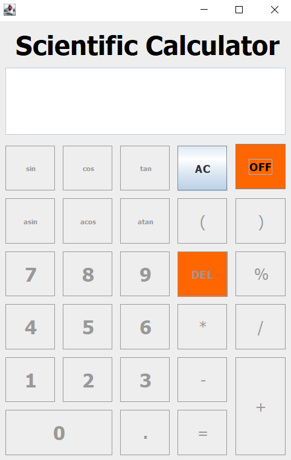
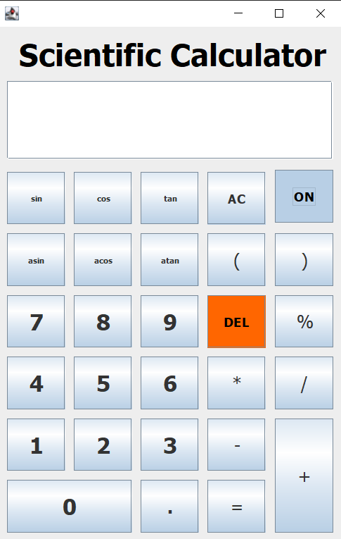
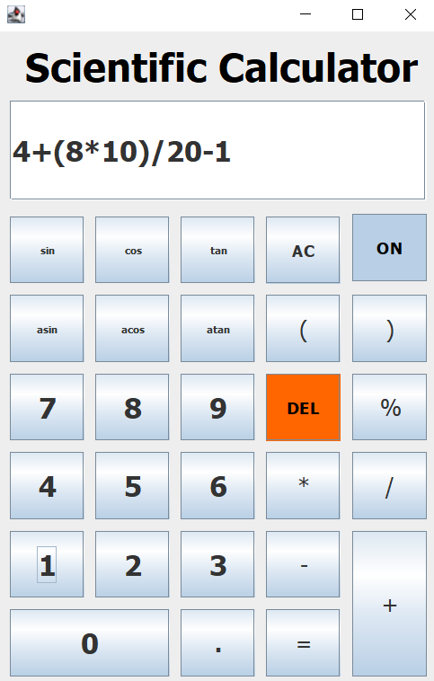
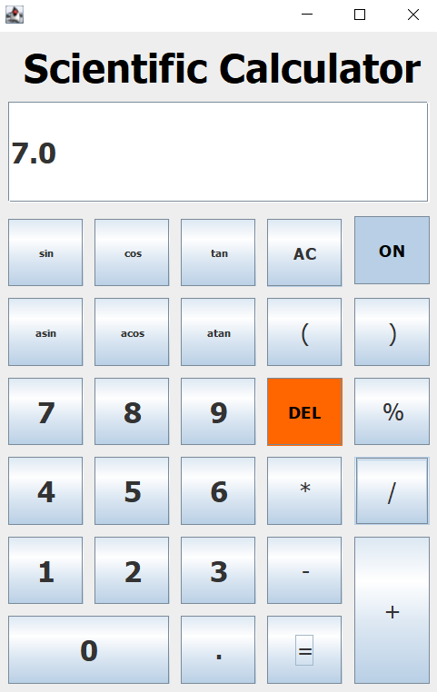
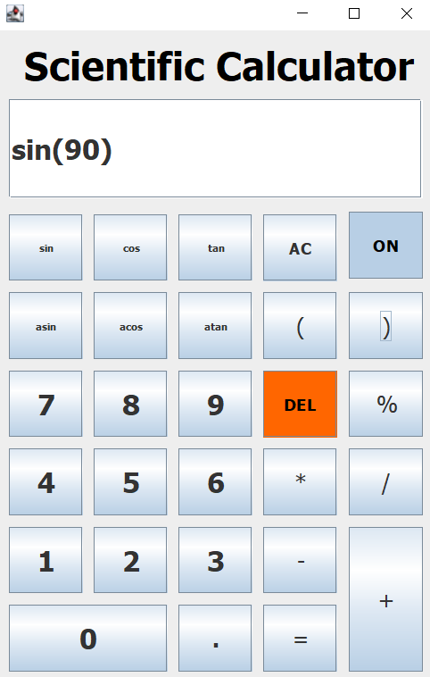
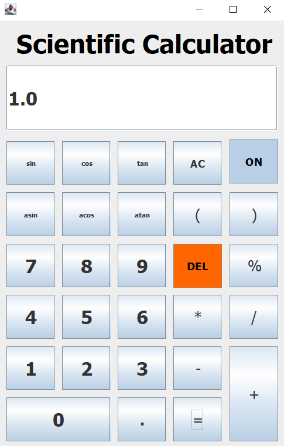

<h1 align="center">
   
  GUI-Calculator in Java & Swing 
   
</h1>

<h4 align="center">GUI Calculator with basic math functions and Trigonometric functions in Java & Swing by using stack data structure.</h4>

  
  
  
   
  <a href="#description">Description</a> 

## Description

This calculator can do basic mathematical functions such as addition, Substraction, Multiplication, Division and Modulus. Also can do Triginometric functions such as Sin, Cs, Tan, aSin, aCos, aTan ETC.  

### ON/OFF Function
- Can ON/OFF by clicking a button. This is gonna active all the buttons initially when click the ON button.   
 
  

### Mathematical Functions According to the BODMAS Theory 
- Also can do mathematical functions.   
 
  

### Trigonometric Functions 
- Also can do trigonometric functions.   
 
  

### Error Handling
- The programme able to identify the errors such as divide by zero, zero divide by zero, and etc.

